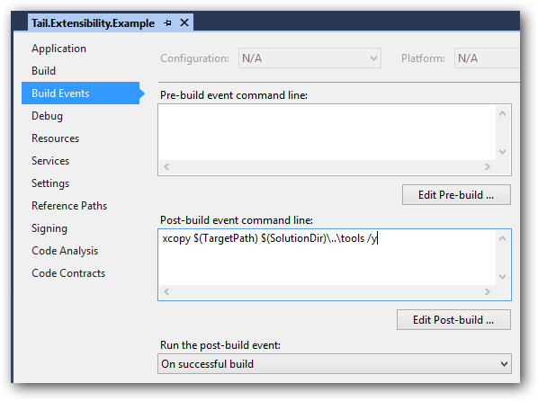
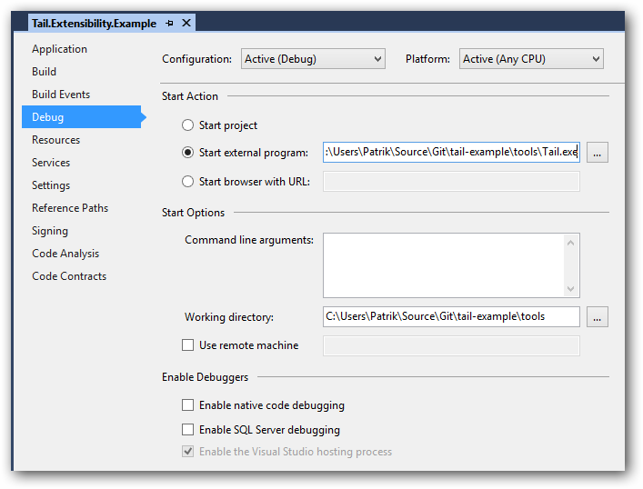

#Tail Example

This repository contains an example of how to extend [Tail](https://github.com/patriksvensson/tail) with a new stream provider.

## How to debug your provider

The Tail application is included in this example for simplicity, but normally you would not want to have any dependencies on the application itself. You want to have a dependency on the extensibility library which you can get via NuGet.

### 1. Copy the provider to the Tail application directory

Set the `post-build event command line`-option to copy your provider DLL to the Tail application directory.

### 2. Set the Visual Studio start option

Set the Visual Studio start option for your provider project to the Tail application.  
Note that the `working directory` isn't mandatory, but nice to have if you want to see how your provider goes along with the default ones.

